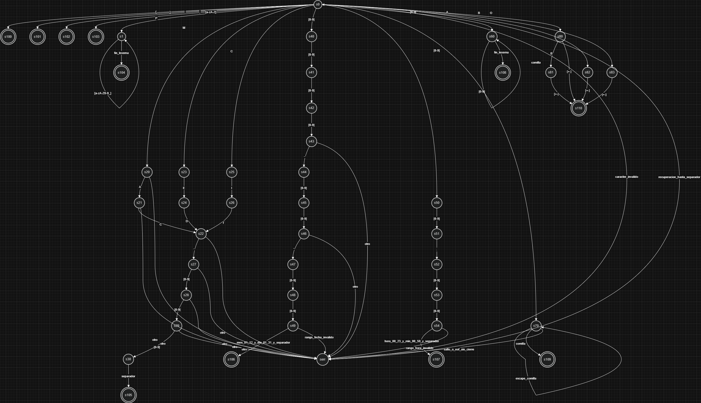

# Manual Tecnico - MedLexer

## 1. Resumen rapido del proyecto
Este proyecto lo hice en C++17 con Qt6 para la interfaz y CMake para compilar.
La idea principal era construir un analizador lexico manual para archivos `.med`, sin usar Flex, Bison ni regex.

## 2. Enfoque del analizador (AFD manual)
El `LexicalAnalyzer` funciona como un AFD programado a mano: va leyendo caracter por caracter y decide a que tipo de token pertenece cada lexema.

Puntos importantes:
- Controla `linea` y `columna` para reportar errores con ubicacion exacta.
- Tiene validaciones estrictas para codigo, fecha y hora.
- Tiene recuperacion de errores (modo panico): cuando encuentra algo invalido, avanza hasta un separador para no trabarse.

## 3. Diagrama del AFD
El diagrama de estados usado para documentar el lexer esta aqui:

## 4. Flujo general del sistema
El flujo real del programa es este:

1. Usuario carga texto `.med`.
2. `LexicalAnalyzer` genera tokens y errores lexicos.
3. `MainWindow` filtra tokens validos y hace extraccion semantica.
4. Se validan reglas de negocio (por ejemplo fecha/hora aunque vengan en cadena).
5. `ReportGenerator` construye HTML y archivo `.dot`.

## 5. Clases principales

### LexicalAnalyzer (`LexicalAnalyzer.h / .cpp`)
Es el motor principal del analisis lexico.
Reconoce delimitadores, identificadores, palabras reservadas, tipo de sangre, codigos, fecha, hora, cadenas y numeros.

### Token (`Token.h / .cpp`)
Representa cada token reconocido:
- lexema
- tipo (`enum class TokenType`)
- linea
- columna

### MainWindow (`MainWindow.h / .cpp`)
Controla la UI (botones, tablas, carga de archivo) y tambien hace parsing semantico para armar estructuras en memoria (pacientes, medicos, citas).
Aqui se aplico un fix importante: si fecha/hora viene invalida dentro de comillas, se descarta y se reporta error semantico.

### ReportGenerator (`ReportGenerator.h / .cpp`)
Recibe datos ya parseados y genera:
- `reporte_pacientes.html`
- `reporte_medicos.html`
- `reporte_citas.html`
- `reporte_estadisticas.html`
- `diagrama.dot`

## 6. Tokens clave usados en el proyecto
- Palabras reservadas: `HOSPITAL`, `PACIENTES`, `MEDICOS`, `CITAS`, `DIAGNOSTICOS`.
- `IDENTIFICADOR_CODIGO`: formato `PAC-000`, `MED-000`, `CIT-000`.
- `FECHA`: `YYYY-MM-DD` con rango valido de mes/dia.
- `HORA`: `HH:MM` con rango valido de hora/minutos.
- `TIPO_SANGRE`: `A+`, `A-`, `B+`, `B-`, `AB+`, `AB-`, `O+`, `O-`.
- `STRING`: cadena entre comillas dobles.
- `ERROR_TOKEN`: cualquier lexema que rompe las reglas del automata.

## 7. Observaciones tecnicas finales
- El lexer cumple la restriccion del curso: 100% manual.
- El parser semantico evita que datos basura lleguen a reportes.
- El sistema es tolerante a errores y no se queda en loops infinitos.